# Antenna Array Simulations with HFSS and MATLAB

This repository contains my Antenna I course project.  
The project studies three related antenna problems using HFSS results and MATLAB array-factor calculations:

1. linear array of parallel dipoles,
2. self and mutual impedance of two half-wave dipoles,
3. square array of parallel dipoles.

The goal was to compare the radiation pattern, matching behavior, mutual coupling, and directivity when the array geometry or excitation changes.

---

## 1. Linear Array of Parallel Dipoles

For a uniform linear array, the array factor can be written as

```math
AF(\theta)=\sum_{n=0}^{N-1} I_n e^{j n (k d \cos\theta+\beta)}
```

where \(d\) is the distance between elements, \(I_n\) is the excitation current, and \(\beta\) is the progressive phase shift.

The total pattern is approximately

```math
F_{total}(\theta,\phi)=F_{element}(\theta,\phi)\,AF(\theta)
```

For a thin dipole along the z-axis,

```math
F_{element}(\theta)\approx \sin\theta .
```

The next figures show the basic broadside/end-fire idea, the HFSS dipole model, port excitation, radiation box, return loss, gain pattern, and directivity pattern.

<p align="center">
  
</p>
<p align="center"><em>Figure 1. Broadside linear dipole array and its expected radiation pattern.</em></p>

<p align="center">
  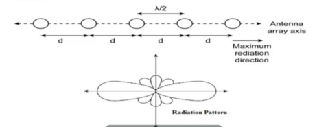
</p>
<p align="center"><em>Figure 2. End-fire linear dipole array and its expected radiation pattern.</em></p>

<p align="center">
  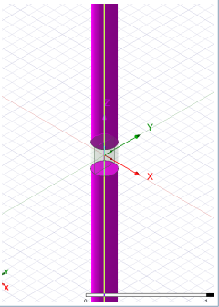
</p>
<p align="center"><em>Figure 3. HFSS model of a single dipole element with a small feeding gap.</em></p>

<p align="center">
  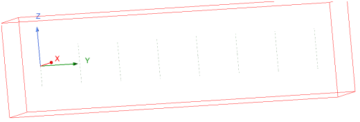
</p>
<p align="center"><em>Figure 4. Final HFSS array geometry inside the radiation boundary box.</em></p>

<p align="center">
  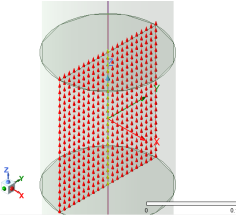
</p>
<p align="center"><em>Figure 5. Electric-field distribution of the lumped-port excitation mode.</em></p>

<p align="center">
  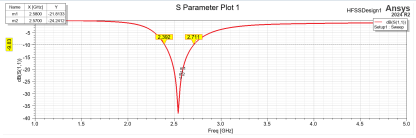
</p>
<p align="center"><em>Figure 6. Return loss, S11, of the simulated dipole array around the design frequency.</em></p>

<p align="center">
  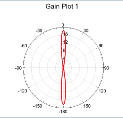
</p>
<p align="center"><em>Figure 7. Two-dimensional gain pattern of the linear dipole array.</em></p>

<p align="center">
  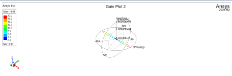
</p>
<p align="center"><em>Figure 8. Three-dimensional gain pattern obtained from HFSS.</em></p>

<p align="center">
  
</p>
<p align="center"><em>Figure 9. Directivity pattern of the array at the operating frequency.</em></p>

From the return-loss plot, the antenna is matched around the design frequency near 2.6 GHz.  
The gain/directivity plots also show that the array makes the main beam narrower compared with a single dipole.

---

## 2. Self and Mutual Impedance of Two Half-Wave Dipoles

For two antennas, the port voltages and currents are related by

```math
\begin{bmatrix}
V_1\\
V_2
\end{bmatrix}
=
\begin{bmatrix}
Z_{11} & Z_{12}\\
Z_{21} & Z_{22}
\end{bmatrix}
\begin{bmatrix}
I_1\\
I_2
\end{bmatrix}
```

The main quantities are

```math
Z_{11}=\left.\frac{V_1}{I_1}\right|_{I_2=0},
\qquad
Z_{12}=\left.\frac{V_1}{I_2}\right|_{I_1=0}.
```

For thin half-wave dipoles, the current distribution can be approximated by

```math
I(z)=I_0\sin\left(k\left(\frac{L}{2}-|z|\right)\right).
```

The mutual impedance is expected to oscillate and decrease as \(d/\lambda\) increases, because the coupling between the two dipoles becomes weaker.

<p align="center">
  
</p>
<p align="center"><em>Figure 10. Self-impedance and mutual-impedance results using the sinusoidal current approximation.</em></p>

<p align="center">
  
</p>
<p align="center"><em>Figure 11. MoM trial result for the real and imaginary parts of mutual impedance.</em></p>

The first result gives the expected qualitative behavior for mutual impedance.  
The second plot is kept as a numerical MoM trial result, but it should be interpreted carefully because its large values at higher distance are not physically expected.

---

## 3. Square Array of Parallel Dipoles

For an \(M \times M\) square array placed in the \(xy\)-plane, the array factor is

```math
AF(\theta,\phi)=
\sum_{m=1}^{M}\sum_{n=1}^{M}
I_{mn}
e^{j[k(x_m\sin\theta\cos\phi+y_n\sin\theta\sin\phi)+\alpha_{mn}]} .
```

To steer the main beam toward \((\theta_0,\phi_0)\), the phase of each element can be chosen as

```math
\alpha_{mn}
=
-k(x_m\sin\theta_0\cos\phi_0+y_n\sin\theta_0\sin\phi_0).
```

The directivity is calculated from

```math
D_0=
\frac{4\pi U_{max}}
{\int_0^{2\pi}\int_0^\pi U(\theta,\phi)\sin\theta\,d\theta\,d\phi}.
```

where

```math
U(\theta,\phi)\propto |AF(\theta,\phi)|^2 |F_{element}(\theta)|^2 .
```

The square-array results show that increasing the number of elements usually increases directivity and makes the main lobe narrower. Increasing the spacing can increase aperture size, but for large spacing it also creates grating lobes.

<p align="center">
  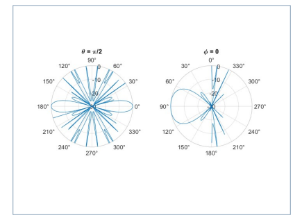
</p>
<p align="center"><em>Figure 12. Directivity versus number of elements for the square array.</em></p>

<p align="center">
  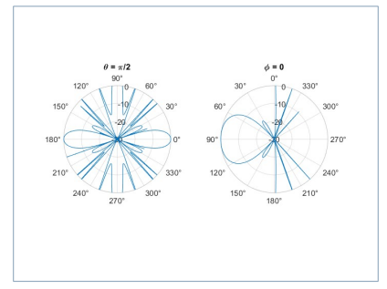
</p>
<p align="center"><em>Figure 13. MATLAB polar cuts for the square array using the built-in array function.</em></p>

<p align="center">
  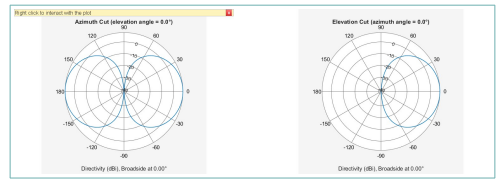
</p>
<p align="center"><em>Figure 14. Radiation-pattern cuts for the square array with a smaller number of elements.</em></p>

<p align="center">
  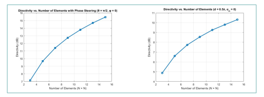
</p>
<p align="center"><em>Figure 15. Radiation-pattern cuts for the square array after changing array parameters.</em></p>

---

## Main Observations

- Increasing the number of elements makes the main beam narrower.
- Larger arrays usually have higher directivity.
- Larger spacing can create more nulls and side lobes.
- For \(d>\lambda/2\), grating lobes may appear.
- The dipole element pattern must be included, because isotropic-array results only show the array-factor behavior.

---

## Tools

- MATLAB
- HFSS
- Antenna array theory
- Method of Moments basics
